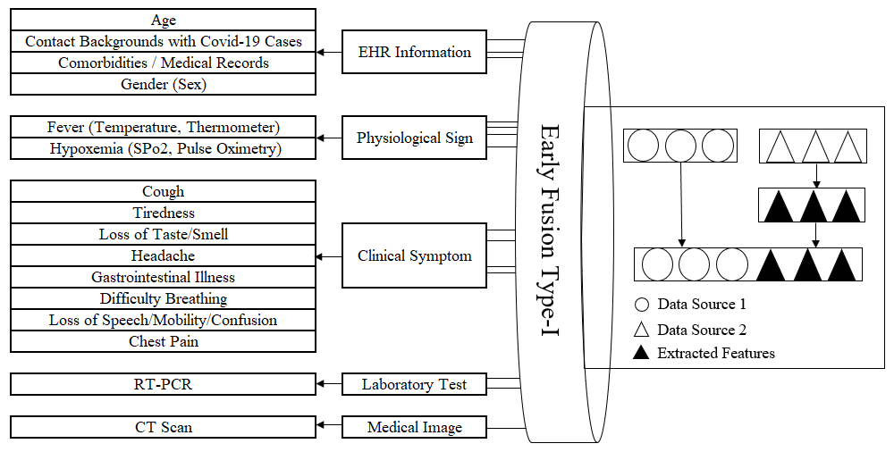

# Covid19_Data_Analysis
**Machine Learning for COVID-19 Data Analysis Project**
* Principal Investigator: Dr. Saman Rajebi [Website]
* Advisor: Dr. Sebelan Danishvar [Website]

**Clinical Diagnostic Tasks**
* Task 1: The COVID-19 Self-Assessment
* Task 2: The The COVID-19 Screening
* Task 3: The The COVID-19 Detection 
* Task 4: The COVID-19 Severity Assessment

**Technical Implementation Tasks**
* Step 1: Data Acquisition for Potential COVID-19 Cases (n=~2500)
* Step 2: Data Encoding for CSV-based Numerical & Categorial Values
* Step 3: Data Fusion for COVID-19 Diagnostic Tasks (Early-Fusion Type I)
* Step 4: Data Annotation for COVID-19 Diagnostic Tasks (Based on WHO Guidelines v2020-2021)
* Step 5: Data Preprocessing for COVID-19 Diagnostic Tasks (e.g., Data Normalization, Handling Missing Value, Duplicate & Outliers Removal, and Data Balancing)
* Step 6: Feature Selection for Comperative Machine Learning Models Improvement (e.g., SelectKBest, Correlation Heatmap, LassoCV, and Extra Tree Classifier)
* Step 7: Developing Comperative Machine Learning Models for Training COVID-19 Diagnostic Tasks (n=9)
* Step 8: Evaluation of Comperative Machine Learning Models for COVID-19 Diagnostic Tasks Validation
* Step 9: Visualization of Comperative Machine Learning Models Outputs (e.g., ROC Curve, Percision-Recall Curve, Confusion Matrix, and Learning Rate)

**A Different Traditional Approach for Automatic Comparative Machine Learning in Multimodality Covid-19 Severity Recognition**

Saraei, M., Rahmani, S., Rajebi, S., Danishvar, S. (2023). Int. J. Innov. Eng., 3(1), 1-12. doi: https://doi.org/10.59615/ijie.3.1.1

In March 2020, the World Health Organization introduced a new infectious pandemic called “novel coronavirus disease” or “COVID-19”, origin dates back to World War II (1939) and spread from the city of Wuhan in China (2019). The severity of the outbreak affected the health of abundant folk worldwide. This bred the emergence of unimodal artificial intelligence approaches in the diagnosis of coronavirus disease but solely led to a significant percentage of false-negative results. In this paper, we combined 2500 COVID-19 multimodal data based on Early Fusion Type-I (EFT1) architecture as a severity recognition model for the classification task. We designed and implemented one-step systems of automatic comparative machine learning (AutoCML) and automatic comparative machine learning based on important feature selection (AutoIFSCML). We utilized our posed assessment method called “Descended Composite Scores Average (DCSA)”. In AutoCML, Extreme Gradient Boost (DCSA=0.998) and in AutoIFSCML, Random Forest (DCSA=0.960) demonstrated the best performance for multimodality Covid-19 severity recognition while 70% of the characteristics with high DCSA were chosen by the internal important features selection system (AutoIFS) to enter the AutoCML system. The DCSA-based designed systems can be useful in implementing fine-tuned machine learning models in medical processes by leveraging the capacities and performances of the model in all methods. As well as ensemble learning sounds good among evaluated traditional models in systems.

